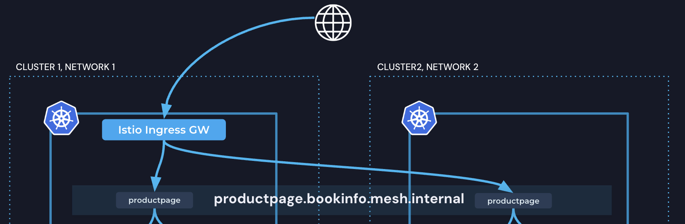
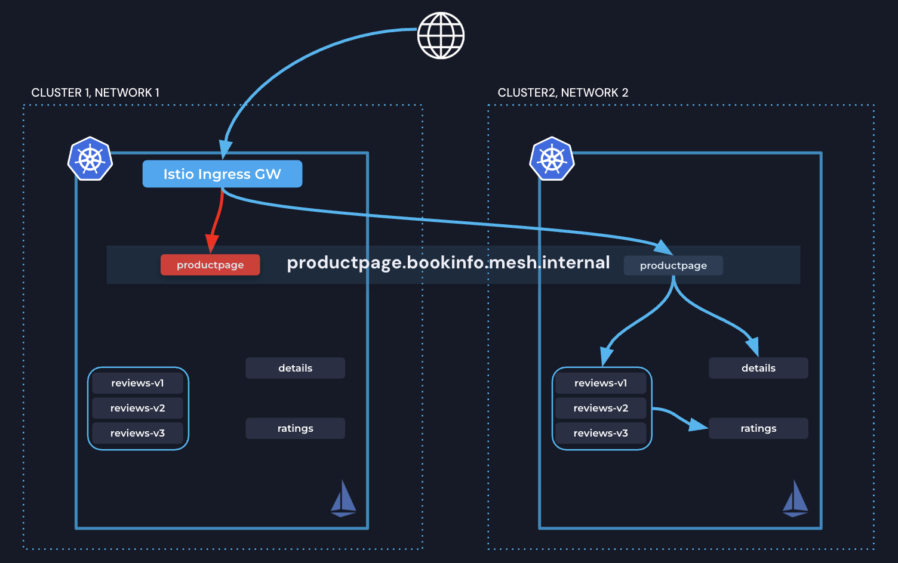
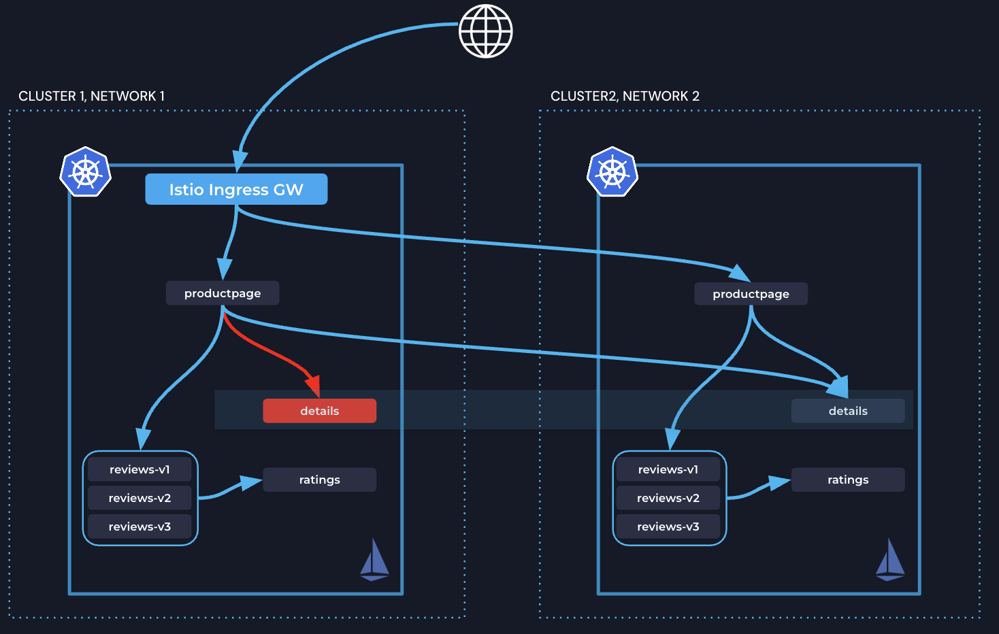

# Solo.io Istio Ambient Multi-cluster Workshop

In this workshop, you will set up Istio Ambient in a multi-cluster environment, deploy a sample Bookinfo app, and explore how Solo.io Ambient enables secure service-to-service communication in all directions.


|[](https://youtu.be/18dpBukOYSk) |
|:-----------------------------:|
### Env

1. Create two clusters and set the env vars below to their context
```bash
export CLUSTER1=gke_ambient_one # UPDATE THIS
export CLUSTER2=gke_ambient_two # UPDATE THIS
export GLOO_MESH_LICENSE_KEY=<update>  # UPDATE THIS
```
2. Download Solo's 1.26.2 `istioctl` Binary:
```bash
OS=$(uname | tr '[:upper:]' '[:lower:]' | sed -E 's/darwin/osx/')
ARCH=$(uname -m | sed -E 's/aarch/arm/; s/x86_64/amd64/; s/armv7l/armv7/')

mkdir -p ~/.istioctl/bin
curl -sSL https://storage.googleapis.com/istio-binaries-d4cba2aff3ef/1.26.2-solo/istioctl-1.26.2-solo-${OS}-${ARCH}.tar.gz | tar xzf - -C ~/.istioctl/bin
chmod +x ~/.istioctl/bin/istioctl

export PATH=${HOME}/.istioctl/bin:${PATH}
```
3. Verify using `istioctl version`

4. Clone this repo and change directory
```bash
git clone https://github.com/rvennam/ambient-multicluster-workshop.git 
cd ambient-multicluster-workshop
```


### Deploy Bookinfo sample to both clusters
```bash
for context in ${CLUSTER1} ${CLUSTER2}; do
  kubectl --context ${context} create ns bookinfo 
  kubectl --context ${context} apply -n bookinfo -f https://raw.githubusercontent.com/istio/istio/release-1.24/samples/bookinfo/platform/kube/bookinfo.yaml
  kubectl --context ${context} apply -n bookinfo -f https://raw.githubusercontent.com/istio/istio/release-1.24/samples/bookinfo/platform/kube/bookinfo-versions.yaml
done
```

### Configure Trust - Issue Intermediate Certs

```bash
for context in ${CLUSTER1} ${CLUSTER2}; do
  kubectl --context=${context} create ns istio-system || true
  kubectl --context=${context} create ns istio-gateways || true
done
kubectl --context=${CLUSTER1} create secret generic cacerts -n istio-system \
--from-file=./certs/cluster1/ca-cert.pem \
--from-file=./certs/cluster1/ca-key.pem \
--from-file=./certs/cluster1/root-cert.pem \
--from-file=./certs/cluster1/cert-chain.pem
kubectl --context=${CLUSTER2} create secret generic cacerts -n istio-system \
--from-file=./certs/cluster2/ca-cert.pem \
--from-file=./certs/cluster2/ca-key.pem \
--from-file=./certs/cluster2/root-cert.pem \
--from-file=./certs/cluster2/cert-chain.pem
```

### Install Istio on both clusters using Gloo Operator

To use HELM instead, see [Helm Instructions](./README_helm.md)

Install the operator
```bash
for context in ${CLUSTER1} ${CLUSTER2}; do
  helm upgrade -i --kube-context=${context} gloo-operator \
    oci://us-docker.pkg.dev/solo-public/gloo-operator-helm/gloo-operator \
    --version 0.2.4 -n gloo-system --create-namespace \
    --set manager.env.SOLO_ISTIO_LICENSE_KEY=${GLOO_MESH_LICENSE_KEY} \
    --set manager.image.repository=us-docker.pkg.dev/solo-public/gloo-operator/gloo-operator &
done
```
Use the `ServiceMeshController` resource to install Istio on both clusters

```bash
kubectl --context=${CLUSTER1} apply -f - <<EOF
apiVersion: operator.gloo.solo.io/v1
kind: ServiceMeshController
metadata:
  name: istio
spec:
  version: 1.26.2
  cluster: cluster1
  network: cluster1
EOF

kubectl --context=${CLUSTER2} apply -f - <<EOF
apiVersion: operator.gloo.solo.io/v1
kind: ServiceMeshController
metadata:
  name: istio
spec:
  version: 1.26.2
  cluster: cluster2
  network: cluster2
EOF
```

### Peer the clusters together

Expose using an east-west gateway:

```
istioctl --context=${CLUSTER1} multicluster expose -n istio-gateways
istioctl --context=${CLUSTER2} multicluster expose -n istio-gateways
```
<details>

<summary>Instead of using istioctl, you can also apply yaml</summary>

```bash
kubectl apply --context $CLUSTER1 -f- <<EOF
apiVersion: gateway.networking.k8s.io/v1
kind: Gateway
metadata:
  labels:
    istio.io/expose-istiod: "15012"
    topology.istio.io/network: cluster1
  name: istio-eastwest
  namespace: istio-gateways
spec:
  gatewayClassName: istio-eastwest
  listeners:
  - name: cross-network
    port: 15008
    protocol: HBONE
    tls:
      mode: Passthrough
  - name: xds-tls
    port: 15012
    protocol: TLS
    tls:
      mode: Passthrough
EOF
```
```bash
kubectl apply --context $CLUSTER2 -f- <<EOF
apiVersion: gateway.networking.k8s.io/v1
kind: Gateway
metadata:
  labels:
    istio.io/expose-istiod: "15012"
    topology.istio.io/network: cluster2
  name: istio-eastwest
  namespace: istio-gateways
spec:
  gatewayClassName: istio-eastwest
  listeners:
  - name: cross-network
    port: 15008
    protocol: HBONE
    tls:
      mode: Passthrough
  - name: xds-tls
    port: 15012
    protocol: TLS
    tls:
      mode: Passthrough
EOF
```
</details>

Link clusters together:

```bash
istioctl multicluster link --contexts=$CLUSTER1,$CLUSTER2 -n istio-gateways
```

<details>

<summary>Instead of using istioctl, you can also apply yaml</summary>

```bash
export CLUSTER1_EW_ADDRESS=$(kubectl get svc -n istio-gateways istio-eastwest --context $CLUSTER1 -o jsonpath="{.status.loadBalancer.ingress[0]['hostname','ip']}")
export CLUSTER2_EW_ADDRESS=$(kubectl get svc -n istio-gateways istio-eastwest --context $CLUSTER2 -o jsonpath="{.status.loadBalancer.ingress[0]['hostname','ip']}")

echo "Cluster 1 east-west gateway: $CLUSTER1_EW_ADDRESS"
echo "Cluster 2 east-west gateway: $CLUSTER2_EW_ADDRESS"

kubectl apply --context $CLUSTER1 -f- <<EOF
apiVersion: gateway.networking.k8s.io/v1
kind: Gateway
metadata:
  annotations:
    gateway.istio.io/service-account: istio-eastwest
    gateway.istio.io/trust-domain: cluster2
  labels:
    topology.istio.io/network: cluster2
  name: istio-remote-peer-cluster2
  namespace: istio-gateways
spec:
  addresses:
  - type: IPAddress
    value: $CLUSTER2_EW_ADDRESS
  gatewayClassName: istio-remote
  listeners:
  - name: cross-network
    port: 15008
    protocol: HBONE
    tls:
      mode: Passthrough
  - name: xds-tls
    port: 15012
    protocol: TLS
    tls:
      mode: Passthrough
EOF

kubectl apply --context $CLUSTER2 -f- <<EOF
apiVersion: gateway.networking.k8s.io/v1
kind: Gateway
metadata:
  annotations:
    gateway.istio.io/service-account: istio-eastwest
    gateway.istio.io/trust-domain: cluster1
  labels:
    topology.istio.io/network: cluster1
  name: istio-remote-peer-cluster1
  namespace: istio-gateways
spec:
  addresses:
  - type: IPAddress
    value: $CLUSTER1_EW_ADDRESS
  gatewayClassName: istio-remote
  listeners:
  - name: cross-network
    port: 15008
    protocol: HBONE
    tls:
      mode: Passthrough
  - name: xds-tls
    port: 15012
    protocol: TLS
    tls:
      mode: Passthrough
EOF
```
</details>

### Enable Istio for bookinfo Namespace

```bash
for context in ${CLUSTER1} ${CLUSTER2}; do
  kubectl --context ${context} label namespace bookinfo istio.io/dataplane-mode=ambient
done
```

### Enable productpage to be multi-cluster on both clusters. 

To make productpage available across clusters, we have the option of one of the following labels on its Kubernetes Service:

#### solo.io/service-scope=global
- Creates a new global service:
`<name>.<namespace>.mesh.internal`
- The original service (`<name>.<namespace>.svc.cluster.local`) remains unchanged and includes only local endpoints.

#### solo.io/service-scope=global-only
- Modifies the original service to include both local and remote endpoints.
- No additional service is created; remote endpoints are merged into the existing service DNS.

Lets use the first option:
```bash
for context in ${CLUSTER1} ${CLUSTER2}; do
  kubectl --context ${context}  -n bookinfo label service productpage solo.io/service-scope=global
  kubectl --context ${context}  -n bookinfo annotate service productpage networking.istio.io/traffic-distribution=Any
done
```

### Expose Productpage using Istio Gateway



Apply the following Kubernetes Gateway API resources to cluster1 to expose productpage service using an Istio gateway:

```yaml
kubectl --context=${CLUSTER1} apply -f - <<EOF
apiVersion: gateway.networking.k8s.io/v1
kind: Gateway
metadata:
  name: bookinfo-gateway
  namespace: bookinfo
spec:
  gatewayClassName: istio
  listeners:
  - name: http
    port: 80
    protocol: HTTP
    allowedRoutes:
      namespaces:
        from: Same
---
apiVersion: gateway.networking.k8s.io/v1
kind: HTTPRoute
metadata:
  name: bookinfo
  namespace: bookinfo
spec:
  parentRefs:
  - name: bookinfo-gateway
  rules:
  - matches:
    - path:
        type: Exact
        value: /productpage
    - path:
        type: PathPrefix
        value: /static
    - path:
        type: Exact
        value: /login
    - path:
        type: Exact
        value: /logout
    - path:
        type: PathPrefix
        value: /api/v1/products
    # backendRefs:
    # - name: productpage
    #   port: 9080
    backendRefs:
    - kind: Hostname
      group: networking.istio.io
      name: productpage.bookinfo.mesh.internal
      port: 9080
EOF
```

Wait until a LB IP gets assigned to bookinfo-gateway-istio svc and then visit the app!

```bash
curl $(kubectl get svc -n bookinfo bookinfo-gateway-istio --context $CLUSTER1 -o jsonpath="{.status.loadBalancer.ingress[0]['hostname','ip']}")/productpage
```
Voila! This should be round robinning between productpage on both clusters.

### Automatic and Manual Failover

#### productpage failover

Scale down productpage on cluster1 to simulate a failure:
```bash
kubectl scale deploy  -n bookinfo productpage-v1 --replicas=0 --context $CLUSTER1
```
Visit the application in your browser and you'll see traffic is not impacted because we're failing over to cluster2 automatically.

Scale productpage back up:
```bash
kubectl scale deploy  -n bookinfo productpage-v1 --replicas=1 --context $CLUSTER1
```
#### details failover

We can also scale down other services. Lets enable `details` to be multi-cluster and scale it down
```bash
kubectl --context $CLUSTER1 -n bookinfo label service details solo.io/service-scope=global-only 
kubectl --context $CLUSTER2 -n bookinfo label service details solo.io/service-scope=global-only 
```
```bash
kubectl scale deploy -n bookinfo details-v1 --replicas=0 --context $CLUSTER1
```

Visit the application in your browser and you'll see traffic is not impacted because we're failing over from productpage.cluster1 to bookinfo.cluster2 automatically.

Scale details back up:
```bash
kubectl scale deploy -n bookinfo details-v1 --replicas=2 --context $CLUSTER1
```


### Istio Waypoints for L7 Functionality

Istio Waypoints enable Layer 7 traffic management in an Ambient Mesh, providing advanced capabilities like routing, authorization, observability, and security policies. Acting as dedicated traffic proxies, Waypoints handle HTTP, gRPC, and other application-layer protocols, seamlessly integrating with Istio’s security model to enforce fine-grained traffic control.

Let’s apply a Waypoint for the bookinfo namespace and create a header-based routing policy:
	•	Traffic going to reviews Service should route to reviews-v1 by default.
	•	Requests with the header end-user: jason should be directed to reviews-v2 instead.


```bash
for context in ${CLUSTER1} ${CLUSTER2}; do
  kubectl --context=${context} label ns bookinfo istio.io/use-waypoint=auto
  kubectl --context=${context} apply -f ./reviews-v1.yaml 
done
```

# Egress Gateway

In addition to managing traffic coming into the mesh and within the mesh, ambient mesh can also manage traffic leaving the mesh. This includes observing the traffic and enforcing policies against it.

Just as a waypoint can be used for traffic addressed to a service inside your cluster, a gateway can be used for traffic that leaves your cluster.

In Istio, you can direct traffic to this gateway on a host-by-host basis using the ServiceEntry resource, which is bound to a waypoint used for egress control.

This section will only use $CLUSTER1.

First, we'll deploy an egress gateway in the `istio-egress` namespace, and call it `egress-gateway`

```bash
kubectl create namespace istio-egress
kubectl apply -f - <<EOF
apiVersion: gateway.networking.k8s.io/v1
kind: Gateway
metadata:
  name: egress-gateway
  namespace: istio-egress
spec:
  gatewayClassName: istio-waypoint
  listeners:
  - name: mesh
    port: 15008
    protocol: HBONE
    allowedRoutes:
      namespaces:
        from: All
EOF
```

If you plan on creating SE's in the istio-egress namespace, you can label just the ns and not need to label every SE:
```
kubectl label ns istio-egress istio.io/use-waypoint=egress-gateway
```

Define httpbin.org on port 40 and 443 as external hosts using ServiceEntries in the `bookinfo` namespace. Notice that we're labeling the ServiceEntry to use the egress gateway

```yaml
kubectl apply -f - <<EOF
apiVersion: networking.istio.io/v1
kind: ServiceEntry
metadata:
  name: httpbin.org
  namespace: bookinfo
  labels:
    istio.io/use-waypoint: egress-gateway
    istio.io/use-waypoint-namespace: istio-egress
spec:
  hosts:
  - httpbin.org
  ports:
  - number: 80
    name: http
    protocol: HTTP
    targetPort: 443
  resolution: DNS
---
apiVersion: networking.istio.io/v1
kind: DestinationRule
metadata:
  name: httpbin.org-tls
  namespace: bookinfo
spec:
  host: httpbin.org
  trafficPolicy:
    tls:
      mode: SIMPLE
EOF
```

Only allow ratings to call httpbin.org
```yaml
kubectl apply -f - <<EOF
apiVersion: security.istio.io/v1
kind: AuthorizationPolicy
metadata:
  name: ratings-to-httpbin
  namespace: bookinfo
spec:
  targetRefs:
  - kind: ServiceEntry
    group: networking.istio.io
    name: httpbin.org
  action: ALLOW
  rules:
  - from:
    - source:
        principals: ["cluster.local/ns/bookinfo/sa/bookinfo-ratings"]
EOF
```

You should now be able to call httpbin.org from ratings:
```bash
kubectl exec -it $(kubectl get pod -l app=ratings -n bookinfo -o jsonpath='{.items[0].metadata.name}') -n bookinfo -- curl -s httpbin.org/get
```

But NOT reviews:
```
kubectl exec -it $(kubectl get pod -l app=reviews -n bookinfo -o jsonpath='{.items[0].metadata.name}') -n bookinfo -- curl -s httpbin.org/get
```

### Bring VMs into the Mesh

Gloo Mesh allows you to extend the mesh to include workloads running on virtual machines (VMs). This enables seamless communication between services running on VM and those running on Kubernetes, providing a unified service mesh.

#### Step 1: Generate the Bootstrap Configuration

To bring a VM into the mesh, you need to generate a bootstrap configuration. This configuration includes the necessary certificates and metadata for the VM to join the mesh.

Run the following command to generate the bootstrap configuration for the VM:

```bash
istioctl bootstrap --namespace vm1 --service-account vm1
```

This command creates a bootstrap token that will be used by the VM to authenticate with the mesh.


#### Step 2:SSH into the VM 

ssh into the VM before proceeding to the next step.

#### Step 3: Set the Bootstrap Token

Copy the token from generated in Step 1 and set it as an environment variable on the VM:

```bash
export BOOTSTRAP_TOKEN=<set from previous command>
```

Replace `<set from previous command>` with the actual token value.

#### Step 4: Run ztunnel on the VM

The ztunnel is a lightweight data plane component that enables the VM to participate in the Ambient Mesh. Run the following command on the VM to start the ztunnel:

```bash
docker run -d -e BOOTSTRAP_TOKEN=${BOOTSTRAP_TOKEN} -e ALWAYS_TRAVERSE_NETWORK_GATEWAY=true --network=host us-docker.pkg.dev/gloo-mesh/istio-d4cba2aff3ef/ztunnel:1.26.2-solo-distroless
```

This command pulls the ztunnel container image and starts it with the necessary configuration to connect to the mesh.

#### Step 5: Test Connectivity from the VM to the Mesh

Once the ztunnel is running, you can test connectivity from the VM to services in the mesh. Use the following commands to verify that the VM can communicate with the `productpage` service in the `bookinfo` namespace:

```bash
export ALL_PROXY=socks5h://127.0.0.1:15080
curl productpage.bookinfo:9080
curl productpage.bookinfo.mesh.internal:9080
```

- The first `curl` command tests connectivity using the service's Kubernetes DNS name.
- The second `curl` command tests connectivity using the service's mesh-internal DNS name.

If both commands return the expected responses, the VM has successfully joined the mesh and can communicate with other services.


## Gloo Management Plane

Optionally, you can deploy the Gloo Management Plane that provides many benefits and features. For this lab, we'll just focus on the UI and the service graph. 

Start by downloading the meshctl cli
```
curl -sL https://run.solo.io/meshctl/install | GLOO_MESH_VERSION=v2.8.0 sh -
export PATH=$HOME/.gloo-mesh/bin:$PATH
```


Cluster1 will act as the management cluster and workload cluster: (see [mgmt-values.yaml](./mgmt-values.yaml) for reference)
```bash
helm repo add gloo-platform https://storage.googleapis.com/gloo-platform/helm-charts
helm repo update

helm upgrade -i gloo-platform-crds gloo-platform/gloo-platform-crds -n gloo-mesh --create-namespace --version=2.8.0 --kube-context=$CLUSTER1
helm upgrade -i gloo-platform gloo-platform/gloo-platform -n gloo-mesh --version 2.8.0 --kube-context=$CLUSTER1 --values mgmt-values.yaml \
  --set licensing.glooMeshLicenseKey=$GLOO_MESH_LICENSE_KEY
```

Then, register cluster2 as a workload cluster to cluster1:
```bash
export TELEMETRY_GATEWAY_ADDRESS=$(kubectl get svc -n gloo-mesh gloo-telemetry-gateway --context $CLUSTER1 -o jsonpath="{.status.loadBalancer.ingress[0]['hostname','ip']}"):4317

meshctl cluster register cluster2  --kubecontext $CLUSTER1 --profiles gloo-mesh-agent --remote-context $CLUSTER2 --telemetry-server-address $TELEMETRY_GATEWAY_ADDRESS
```

Launch the UI:
```
meshctl dashboard
```

