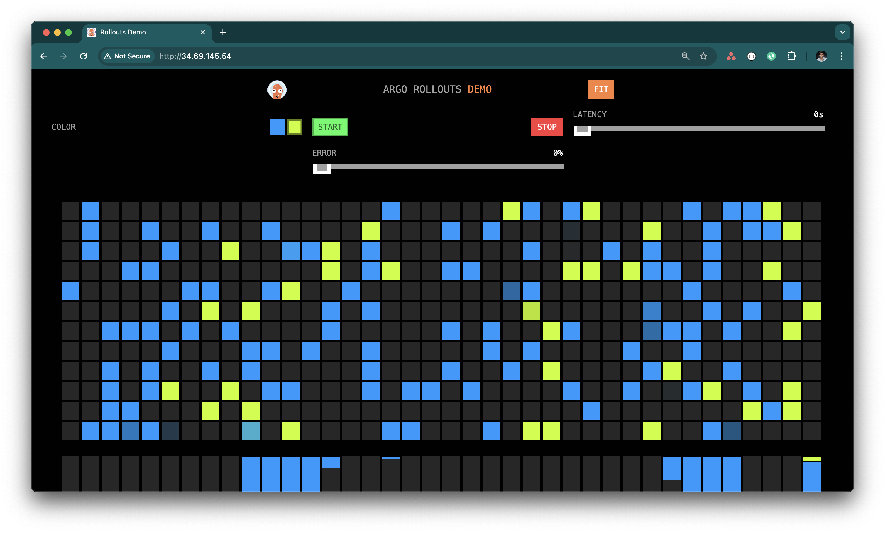

# Pre-req
- Perform the steps in the ./README.md to install Istio and bookinfo samples

# Install Argo Rollouts

Controller Installation:
```
kubectl create namespace argo-rollouts
kubectl apply -n argo-rollouts -f https://github.com/argoproj/argo-rollouts/releases/latest/download/install.yaml
```

```
apiVersion: v1
kind: ConfigMap
metadata:
  name: argo-rollouts-config # must be named like this
  namespace: argo-rollouts # must be in this namespace
data:
  trafficRouterPlugins: |-
    - name: "argoproj-labs/gatewayAPI"
      location: "https://github.com/argoproj-labs/rollouts-plugin-trafficrouter-gatewayapi/releases/download/v0.6.0/gatewayapi-plugin-linux-amd64"

```
Kubectl Plugin Installation:
```
brew install argoproj/tap/kubectl-argo-rollouts
```
Allow ArgoRollouts to edit HTTPRoutes
```yaml
---
apiVersion: rbac.authorization.k8s.io/v1
kind: ClusterRole
metadata:
  name: gateway-controller-role
  namespace: argo-rollouts
rules:
  - apiGroups:
      - gateway.networking.k8s.io
    resources:
      - httproutes
    verbs:
      - get
      - patch
      - update
---
apiVersion: rbac.authorization.k8s.io/v1
kind: ClusterRoleBinding
metadata:
  name: gateway-admin
roleRef:
  apiGroup: rbac.authorization.k8s.io
  kind: ClusterRole
  name: gateway-controller-role
subjects:
  - namespace: argo-rollouts
    kind: ServiceAccount
    name: argo-rollouts
```

Finally, edit the `argo-rollouts` ClusterRole and add `create` permissions for `configmaps`

# Deploy Sample Application

```yaml
apiVersion: v1
kind: Service
metadata:
  name: argo-rollouts-stable-service
  namespace: bookinfo
spec:
  ports:
    - port: 80
      targetPort: http
      protocol: TCP
      name: http
  selector:
    app: rollouts-demo
---
apiVersion: v1
kind: Service
metadata:
  name: argo-rollouts-canary-service
  namespace: bookinfo
spec:
  ports:
    - port: 80
      targetPort: http
      protocol: TCP
      name: http
  selector:
    app: rollouts-demo
---
apiVersion: argoproj.io/v1alpha1
kind: Rollout
metadata:
  name: rollouts-demo
  namespace: bookinfo
spec:
  replicas: 5
  strategy:
    canary:
      canaryService: argo-rollouts-canary-service # our created canary service
      stableService: argo-rollouts-stable-service # our created stable service
      trafficRouting:
        plugins:
          argoproj-labs/gatewayAPI:
            httpRoute: argo-rollouts-http-route # our created httproute
            namespace: bookinfo
      steps:
      - setWeight: 20
      - pause: {}
      - setWeight: 40
      - pause: {duration: 10}
      - setWeight: 60
      - pause: {duration: 10}
      - setWeight: 80
      - pause: {duration: 10}
  revisionHistoryLimit: 2
  selector:
    matchLabels:
      app: rollouts-demo
  template:
    metadata:
      labels:
        app: rollouts-demo
    spec:
      containers:
        - name: rollouts-demo
          image: argoproj/rollouts-demo:blue
          ports:
            - name: http
              containerPort: 8080
              protocol: TCP
          resources:
            requests:
              memory: 32Mi
              cpu: 5m

```

Set Route to the sample application

```yaml
kind: HTTPRoute
apiVersion: gateway.networking.k8s.io/v1beta1
metadata:
  name: argo-rollouts-http-route
  namespace: bookinfo
spec:
  parentRefs:
  - name: bookinfo-gateway
  rules:
  - matches:
    - path:
        type: PathPrefix
        value: /
    backendRefs:
    - name: argo-rollouts-stable-service
      kind: Service
      port: 80
    - name: argo-rollouts-canary-service
      kind: Service
      port: 80
```

Visit the app:


```sh
$ kubectl argo rollouts get rollout rollouts-demo -n bookinfo
Name:            rollouts-demo
Namespace:       bookinfo
Status:          ✔ Healthy
Strategy:        Canary
  Step:          8/8
  SetWeight:     100
  ActualWeight:  100
Images:          argoproj/rollouts-demo:blue (stable)
Replicas:
  Desired:       5
  Current:       5
  Updated:       5
  Ready:         5
  Available:     5

NAME                                       KIND        STATUS        AGE    INFO
⟳ rollouts-demo                            Rollout     ✔ Healthy     4h33m  
├──# revision:5                                                             
│  └──⧉ rollouts-demo-687d76d795           ReplicaSet  ✔ Healthy     4h33m  stable
│     ├──□ rollouts-demo-687d76d795-5k4rn  Pod         ✔ Running     4h23m  ready:1/1
│     ├──□ rollouts-demo-687d76d795-9jzmw  Pod         ✔ Running     4h23m  ready:1/1
│     ├──□ rollouts-demo-687d76d795-c9snt  Pod         ✔ Running     4h23m  ready:1/1
│     ├──□ rollouts-demo-687d76d795-ctjwn  Pod         ✔ Running     4h23m  ready:1/1
│     └──□ rollouts-demo-687d76d795-rfrjk  Pod         ✔ Running     4h23m  ready:1/1
└──# revision:4                                                             
   └──⧉ rollouts-demo-6cf78c66c5           ReplicaSet  • ScaledDown  4h18m  delay:passed
```

# Perfom Canary Upgrade

Step 1: Update the image to the yellow version

kubectl argo rollouts set image -n bookinfo rollouts-demo rollouts-demo=argoproj/rollouts-demo:yellow

As you can see, 20% of the responses are now yellow and it will wait here until a manual promotion.


Promote the canary. As we defined in the Rollout, traffic will jump to 40%, 60%, 80% and 100% in 10 second intervals
```
kubectl argo rollouts promote rollouts-demo -n bookinfo
```


Abort the rollout and traffic will revert back to the stable:
```
kubectl argo rollouts abort rollouts-demo -n bookinfo
```
